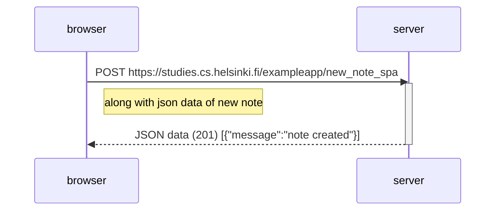

```mermaid
  sequenceDiagram
    participant browser
    participant server
    browser->>server: POST https://studies.cs.helsinki.fi/exampleapp/new_note_spa
    activate server
    Note right of browser: along with json data of new note
    server-->>browser: JSON data (201) [{"message":"note created"}]
    deactivate server
```
